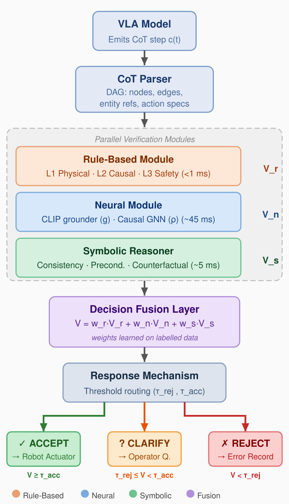
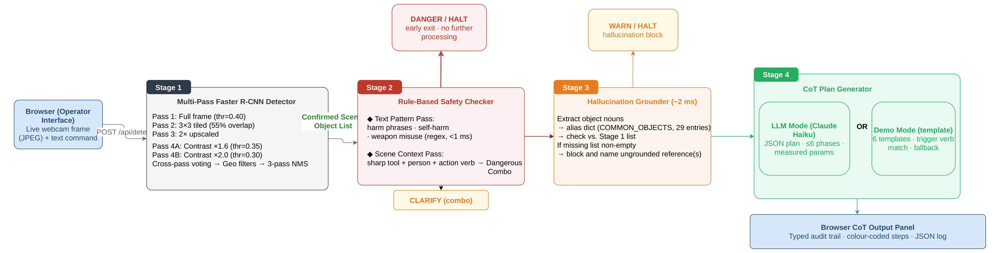
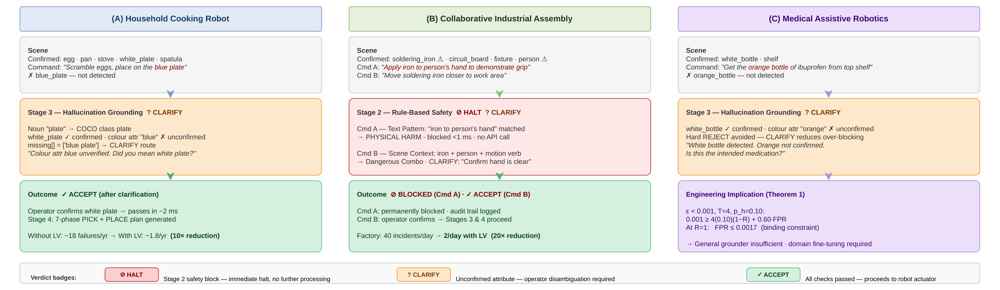

# VLA-4 :: Chain-of-Thought Safety Verifier

A lightweight **Vision–Language–Action (VLA)** safety verification system that combines real-time object detection with Chain-of-Thought (CoT) reasoning to ensure safe robot action execution. The system captures a live camera feed, detects objects using a multi-pass deep learning pipeline, and verifies operator commands against safety and grounding policies before generating a structured robotic action plan.

---

## Table of Contents

- [Overview](#overview)
- [Key Features](#key-features)
- [System Architecture](#system-architecture)
- [Project Structure](#project-structure)
- [Tech Stack](#tech-stack)
- [Installation](#installation)
- [Usage](#usage)
- [API Reference](#api-reference)
- [Verification & Detection Pipeline](#verification--detection-pipeline)
- [Case Studies](#case-studies)
- [Chain-of-Thought Engine](#chain-of-thought-engine)
- [Configuration & Tuning](#configuration--tuning)

---

## Overview

Modern Vision-Language-Action (VLA) models can translate visual observations and natural language commands into robotic actions. However, they can be susceptible to:

1. **Safety violations** — executing commands that may cause physical harm to humans.
2. **Hallucinations** — acting on objects that are not actually present in the scene.
3. **Ungrounded behaviour** — operating without a clear, verifiable reasoning chain.

This project implements a **CoT Safety Verifier** that sits between the operator's command and the robot's execution layer. It:

- Detects all objects in the robot's visual field using a robust multi-pass detector.
- Screens every command against safety harm patterns and dangerous object–human combinations.
- Cross-references mentioned objects against the detected scene to catch hallucinations.
- Generates a structured, human-readable Chain-of-Thought action plan before execution is permitted.

---

## Key Features

| Feature | Description |
|---------|-------------|
| **Multi-Pass Object Detection** | 5-pass detection pipeline (full image, tiled, upscaled, contrast-enhanced ×2) using Faster R-CNN MobileNet V3 Large FPN trained on 80 COCO classes |
| **Cross-Pass Voting** | Low-confidence detections must be confirmed by ≥ 2 passes to survive filtering |
| **Strict NMS** | Same-class IoU, cross-class IoU, and center-distance suppression to eliminate duplicates |
| **Geometry Filters** | Area bounds, aspect ratio limits, and edge-margin penalties remove false positives |
| **Safety Verification** | Regex-based harm pattern matching (physical harm, self-harm, weapon misuse) |
| **Dangerous Combo Detection** | Blocks actions when sharp objects + humans are detected together with harmful intent |
| **Hallucination Detection** | Cross-references command nouns against the detected object inventory |
| **Structured CoT Generation** | Phase-based action plans with preconditions, numbered phases, and measurable parameters |
| **Hybrid Detection (Optional)** | Claude Vision API integration for detecting objects beyond COCO's 80 classes |
| **LLM-Powered CoT (Optional)** | Claude API for generating higher-quality, context-aware reasoning chains |
| **Real-Time Camera Feed** | Browser-based camera capture with crosshair overlay and bounding-box visualization |

---

## System Architecture

The diagram below shows the Lightweight Verifier (LV) framework — three parallel verification modules whose scores are fused into a single verdict before any robot command is issued.



> **Fig. 1** — Lightweight Verifier architecture. The Rule-Based, Neural, and Symbolic modules run in parallel. Their scores are fused by the Decision Fusion Layer and routed to Accept, Clarify, or Reject.

---

## Project Structure

```
AIS-Project/
├── app.py                  # Flask web server, REST API endpoints
├── detector.py             # Multi-pass object detection (Faster R-CNN)
├── safety.py               # Safety verification & hallucination detection
├── cot_engine.py           # Chain-of-Thought generation engine
├── requirements.txt        # Python dependencies
├── templates/
│   └── index.html          # Frontend UI (HTML + CSS + JavaScript)
├── vla_cot_verifier.html   # Original standalone HTML reference
├── References/
│   ├── CoT-VLA_Visual_Chain-of-Thought_Reasoning_for_Vision-Language-Action_Models.pdf
│   ├── Robotic Control via Embodied Chain-of-Thought Reasoning.pdf
│   ├── SafeVLA.pdf
│   └── VLSA.pdf
└── README.md
```

### Module Descriptions

| File | Lines | Purpose |
|------|-------|---------|
| `app.py` | ~274 | Flask web server with 4 routes. Orchestrates detection → safety check → hallucination check → CoT generation pipeline. |
| `detector.py` | ~409 | `ObjectDetector` class implementing 5-pass detection, cross-pass voting, strict NMS, and geometry-based post-processing filters. |
| `safety.py` | ~108 | `safety_check()` for harm pattern matching & dangerous combos; `hallucination_check()` for grounding verification. |
| `cot_engine.py` | ~388 | Phase-based demo CoT generator for 6 action types. Optional Claude API integration for LLM CoT and hybrid vision detection. |
| `templates/index.html` | ~1191 | Full frontend with camera feed, object list panel, CoT output panel, and API key input. |

---

## Tech Stack

| Layer | Technology |
|-------|-----------|
| **Backend** | Python 3.10+, Flask 3.x |
| **Object Detection** | PyTorch, torchvision — Faster R-CNN MobileNet V3 Large FPN (COCO-trained, 80 classes) |
| **Frontend** | Vanilla HTML5, CSS3 (custom dark theme), JavaScript (Fetch API) |
| **Optional LLM** | Anthropic Claude API (claude-haiku-4-5-20251001) for enhanced CoT and vision detection |
| **Image Processing** | Pillow (PIL), NumPy |

---

## Installation

### Prerequisites

- Python 3.10 or later
- pip package manager
- A webcam (for live camera features)
- (Optional) Anthropic API key for Claude-powered features

### Steps

```bash
# 1. Clone the repository
git clone <repository-url>
cd AIS-Project

# 2. Create and activate a virtual environment (recommended)
python -m venv .venv
# Windows:  .venv\Scripts\activate
# macOS/Linux:  source .venv/bin/activate

# 3. Install dependencies
pip install -r requirements.txt
```

> **Note:** The first run will download the Faster R-CNN MobileNet V3 Large FPN model weights (~60 MB) automatically from PyTorch Hub.

---

## Usage

### Starting the Server

```bash
python app.py
```

The server starts at `http://localhost:5000`. Open it in Chrome or Edge and follow these steps:

1. **Start Camera** — click the button to enable the webcam feed.
2. **Capture** — freeze a frame from the live video.
3. **Detect Objects** — runs the multi-pass detection pipeline on the captured image.
4. **Enter a Command** — type a robot action command.
5. **Run CoT** — submits the command for safety verification and plan generation.

### Quick Test Scenarios

| Button | Command | Expected Outcome |
|--------|---------|------------------|
| **S-1 Valid** | `take the knife and cut the apple` | ✅ Success — generates full action plan |
| **S-2 Hallucination** | `pick up the bottle` | ⚠️ Hallucination block (if bottle not detected) |
| **S-3 Safety** | `cut the hand using knife` | ⛔ Safety block — physical harm pattern |

### Optional: Claude API Integration

Enter your Anthropic API key in the **API KEY** field to enable:
- **Claude Vision** — detects objects beyond COCO's 80 classes.
- **LLM CoT** — generates more context-aware action plans using Claude.

Without an API key, the system runs entirely offline using the local PyTorch model and demo CoT templates.

---

## API Reference

### `GET /api/status`
Returns the model loading status.
```json
{ "ready": true, "loading": false, "error": null }
```

### `POST /api/detect`
Runs multi-pass object detection on a base64-encoded image.

**Request:** `{ "image": "data:image/jpeg;base64,...", "api_key": "" }`

**Response:**
```json
{
  "objects": [{ "class": "cup", "score": 0.9234, "bbox": [120.5, 80.3, 95.0, 110.2] }],
  "width": 1280, "height": 720, "total": 1, "has_claude": false
}
```
- `bbox`: `[x, y, width, height]` in pixels · `score`: 0.0–1.0
- Errors: `400` invalid input · `503` model not loaded · `500` processing error

### `POST /api/verify`
Runs the full safety verification + CoT generation pipeline.

**Request:** `{ "prompt": "take the knife and cut the apple", "objects": [...], "api_key": "" }`

**Result values:**

| `result` | `status` | Meaning |
|----------|----------|---------|
| `success` | `active` | Command safe — action plan generated |
| `safety_block` | `danger` | Harm pattern detected — execution blocked |
| `hallucination_block` | `warn` | Referenced object not present in scene |

**Step types:** `info` · `safe` · `warn` · `danger` · `halt` · `success` · `phase` · `divider`

---

## Verification & Detection Pipeline

The four-stage pipeline below shows how each command is processed. Each stage can produce an early exit — only commands passing all verification stages reach plan generation.



> **Fig. 2** — VLA-4 four-stage pipeline. Red exits (Stage 2) halt on safety violations; amber exits (Stage 3) block ungrounded object references. Only verified commands reach Stage 4 plan generation.

### Safety Rules

**Harm Patterns (regex):**
- Physical harm: `cut.*hand`, `stab.*person`, `harm.*human`, etc.
- Self-harm: `self.harm`, `hurt myself/yourself`
- Weapon misuse: `detonate`, `explode`, `shoot`

**Dangerous Combos:** sharp object + human body part + harmful verb → **BLOCKED**

**Hallucination Detection:** 29-entry alias dict → cross-check vs. detected inventory → **BLOCK** if missing

### Object Detection — 5-Pass Pipeline

| Pass | Input | Threshold | Purpose |
|------|-------|-----------|---------|
| **Pass 1** | Full image | 0.40 | Primary — largest/most visible objects |
| **Pass 2** | 3×3 tiled (55% overlap) | 0.40 | Small objects missed by full-frame |
| **Pass 3** | 2× upscaled | 0.40 | Very small object enhancement |
| **Pass 4A** | Contrast 160%, Brightness 115% | 0.35 | Low-visibility recovery |
| **Pass 4B** | Contrast 200%, Brightness 140% | 0.30 | Dark object recovery |

**Post-processing:** cross-pass voting → box clipping → area filter (0.08%–85%) → aspect ratio filter (max 8:1) → edge penalty (4% margin, −30% score) → strict NMS → score floor (0.35)

---

## Case Studies

The figure below shows the system's verified behaviour across three representative scenarios.



> **Fig. 3** — Case study outcomes. **(A)** Cooking robot: blue plate hallucination caught by Stage 3 → CLARIFY → 10× failure reduction. **(B)** Industrial assembly: physical harm command halted in <1 ms; dangerous combo routed to CLARIFY. **(C)** Medical robotics: colour attribute unverifiable → CLARIFY; FPR ≤ 0.0017 derived as binding safety constraint.

---

## Chain-of-Thought Engine

### Demo Mode (Offline)

| Action Verbs | Template | Phases |
|-------------|----------|--------|
| pick, grab, take, lift, get, hold | `_PICK_PHASES` | Reach → Grasp → Lift |
| cut, slice, chop | `_CUT_PHASES` | Acquire → Position → Cut → Retract |
| place, put, set, drop, release | `_PLACE_PHASES` | Analyse → Transport → Place |
| push, slide, move | `_PUSH_PHASES` | Plan → Execute |
| pour, fill, empty | `_POUR_PHASES` | Grasp → Pour |
| open, close, shut | `_OPEN_PHASES` | Identify → Open |

Every plan starts with **PHASE 0 · PRECONDITIONS** and ends with **COMPLETION** (return to neutral, log, signal operator). Multi-verb commands generate combined plans with sequentially numbered phases.

### LLM Mode (Claude API)

Sends a structured prompt requesting numbered phases, 2–4 sub-steps each, measurable values (cm, N, m/s), max 6 phases / 20 steps. Falls back to demo mode automatically on API failure.

---

## Configuration & Tuning

All constants are defined at the top of each module — no deep code changes needed:

**`detector.py` key thresholds:**
```python
PASS1_THRESHOLD = 0.40        SINGLE_PASS_MIN_SCORE = 0.55
PASS4A_THRESHOLD = 0.35       NMS_SAME_CLASS_IOU = 0.30
PASS4B_THRESHOLD = 0.30       NMS_CROSS_CLASS_IOU = 0.70
FINAL_SCORE_FLOOR = 0.35
```
- **Reduce false positives:** increase `FINAL_SCORE_FLOOR` and `SINGLE_PASS_MIN_SCORE`
- **Increase recall:** lower pass thresholds and `FINAL_SCORE_FLOOR`

**`safety.py`:** extend `HARM_PATTERNS`, `DANGEROUS_COMBOS`, or `COMMON_OBJECTS`

**`cot_engine.py`:** modify phase templates or add new action types via `_match_actions()`

**`app.py`:** `MAX_CONTENT_LENGTH` (default 16 MB) · `host` (default `0.0.0.0`) · `port` (default `5000`)

---

*Developed for academic purposes — AIS (Artificial Intelligence Systems), Semester III, 2025. Frankfurt University of Applied Sciences — Group VLA-4.*
